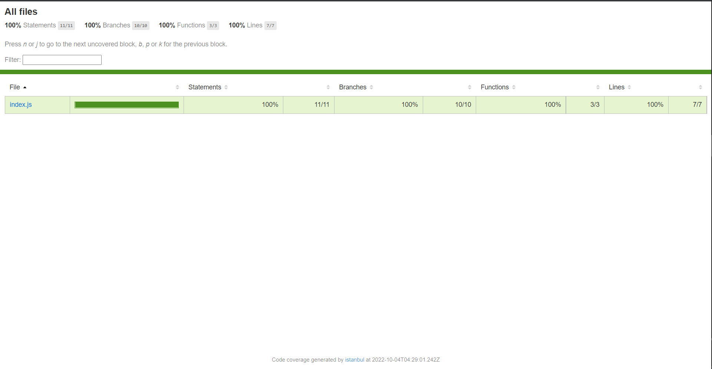

## Setup Jest for JavaScript 🚩🚩

> You can read docs [here](https://jestjs.io/docs/getting-started)

-   You can **install** extension VSCode for code `Jest` to support for coding:

    -   [Jest](https://marketplace.visualstudio.com/items?itemName=Orta.vscode-jest)
    -   [Jest snippets](https://marketplace.visualstudio.com/items?itemName=andys8.jest-snippets)
    -   [Jest runner](https://marketplace.visualstudio.com/items?itemName=firsttris.vscode-jest-runner)

-   Then, you create folder: `npm init` and setting folder
-   Then, you add package:

```js
// install package
`yarn add -D jest` // use to install jest to run
`yarn add -D babel-jest @babel/core @babel/preset-env` // use to support syntax for ES6 module, new version
// example: use import/export instead of use `module.exports`

`create file `babel.config.js` and write code file here`
module.exports = {
  presets: [['@babel/preset-env', {targets: {node: 'current'}}]],
};
```

-   You can add `"test": "jest --coverage"`

```js
// package.json
"scripts": {
    "test": "jest --coverage"
},
```

## Structure file of Jest 🎫🎫

> You can read structure file of Jest by [docs](https://jestjs.io/docs/setup-teardown).

```js
beforeAll(() => console.log('1 - beforeAll'))
afterAll(() => console.log('1 - afterAll'))
beforeEach(() => console.log('1 - beforeEach'))
afterEach(() => console.log('1 - afterEach'))

test('', () => console.log('1 - test'))

describe('Scoped / Nested block', () => {
    beforeAll(() => console.log('2 - beforeAll'))
    afterAll(() => console.log('2 - afterAll'))
    beforeEach(() => console.log('2 - beforeEach'))
    afterEach(() => console.log('2 - afterEach'))

    test('', () => console.log('2 - test'))
})

// 1 - beforeAll
// 1 - beforeEach
// 1 - test
// 1 - afterEach
// 2 - beforeAll
// 1 - beforeEach
// 2 - beforeEach
// 2 - test
// 2 - afterEach
// 1 - afterEach
// 2 - afterAll
// 1 - afterAll
```

## Common matcher in Jest 🔍🔍

> You can read more [here](https://jestjs.io/docs/using-matchers) about common matcher in Jest.

-   Examples:

```js
// the simplest way to test value
test('two plus two is four', () => {
    expect(2 + 2).toBe(4)
})
```

> **toBe** use `Object.is()` to test equality.

> You want to check type `object`, you can use `toEqual()`, **it** check each field(key) of an object or array.

```js
test('object assignment', () => {
    const data = { one: 1 }
    data['two'] = 2
    expect(data).toEqual({ one: 1, two: 2 })
})
```

-   **describe** is group of all `test` case that we specify it, and write all test case of function or other.
-   **describe** have lot of `test`, only 1 `test` not pass test case then this **describe** also not pass test case.

```js
describe('classifyStudent() - description here...', () => {
    test('should return Invalid mark! when pass invalid number', () => {
        expect(classifyStudent('abc')).toBe('Invalid mark')
    })

    test('should return Excellence! when mark > 8', () => {
        expect(classifyStudent(8.5)).toBe('Excellence')
    })

    test('should return Good! when mark >= 7', () => {
        expect(classifyStudent(7.5)).toBe('Good')
    })

    test('should return Not Good! when mark >= 4', () => {
        expect(classifyStudent(6)).toBe('Not Good')
    })

    test('should return Bad! when mark < 4', () => {
        expect(classifyStudent(3)).toBe('Bad')
    })
})
```

-   **test** have lot of `expect`, only 1 `expect` not pass test case then this **test** also not pass test case.

```js
describe('classifyStudent() - description here...', () => {
    test('should return Invalid mark! when pass invalid number', () => {
        expect(classifyStudent(5)).toBe('Not Good')
        expect(classifyStudent(6)).toBe('Not Good')
        expect(classifyStudent(6.5)).toBe('Not Good')
    })
})
```

> You can use code **JS** to do it fast. 😆😆😆

```js
describe('classifyStudent() - description here...', () => {
    test('should return Invalid mark! when pass invalid number', () => {
        ;[5, 6, 6.5].forEach((mark) => {
            expect(classifyStudent(mark)).toBe('Not Good')
        })
    })
})

// it is refactor code, right! 😍😍
```

-   You can `yarn run test` and go to folder `coverage > icov-report > index.html` live server to check function has checked all test case?



## Matcher Types in Jest 📜📜

-   You can read more [here](https://jestjs.io/docs/using-matchers) about `Truthiness`, `Numbers`, `Strings`, `Arrays and iterables`, `Exceptions`, **...**
